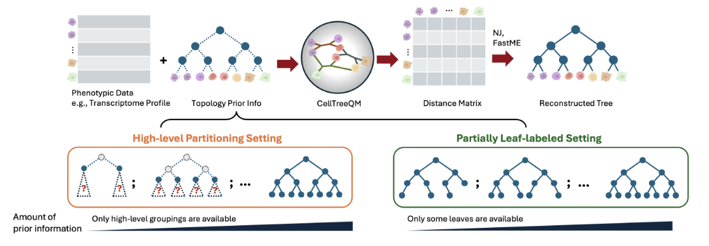

## CellTreeQM: Reconstructing Cell Lineage Trees from Phenotypic Features via Metric Learning

[](https://proceedings.mlr.press/v267)

This repository provides the official implementation of **CellTreeQM**, introduced in our ICML 2025 paper:

> **Reconstructing Cell Lineage Trees from Phenotypic Features with Metric Learning**  
> *Da Kuang, Guanwen Qiu, Junhyong Kim*  
> 📄 [Read the paper](https://arxiv.org/abs/2503.13925)  
> 🌐 [Project page](https://kuang-da.github.io/CellTreeQM-page/)

---

### 🔍 Overview

CellTreeQM is a **deep learning framework** for reconstructing cell lineage trees directly from phenotypic features (e.g., transcriptomic data).  
By casting the problem as **metric learning**, it learns an embedding space optimized for tree-metric properties using **quartet-based loss functions**.



---

### 📦 Code Release

We are actively refactoring the research codebase into a user-friendly package.  
This repository currently provides the **initial functional release**, with additional features and improvements planned.  

A fully reproducible training pipeline is available in our companion [paper repository](https://github.com/kuang-da/CellTreeQM-paper).  

If you’d like to follow updates, please **star ⭐ this repository**!
---

### 📖 Citation

If you find CellTreeQM useful, please cite our paper:

```bibtex
@article{kuang2025reconstructingcelllineagetrees,
  title   = {Reconstructing Cell Lineage Trees from Phenotypic Features with Metric Learning},
  author  = {Da Kuang and Guanwen Qiu and Junhyong Kim},
  year    = {2025},
  eprint  = {2503.13925},
  archivePrefix = {arXiv},
  primaryClass  = {cs.LG},
  url     = {https://arxiv.org/abs/2503.13925}
}
```

---

### ⚙️ Installation (Development)

```bash
pip install -e /workspaces/CellTreeQM/CellTreeQM
# Optional: dataset utilities
pip install -e /workspaces/CellTreeQM/CellTreeBench
# Add /home/kuangda/.local/bin to your PATH
export PATH="/home/kuangda/.local/bin:$PATH"
# Or add to ~/.bashrc
echo 'export PATH="$HOME/.local/bin:$PATH"' >> ~/.bashrc
```

**Dependencies (auto-installed via pip):**  
`torch`, `numpy`, `scipy`, `biopython`, `ete3`, `tqdist`

---

### 🚀 Command-Line Interface (CLI)

After installation, a `celltreeqm` command becomes available.  
For example, training on the *C. elegans* dataset from **CellTreeBench**:

```bash
# Dataset artifacts live under bench-root; experiment outputs are independent
export CELLTREEQM_OUTPUT_DIR=/workspaces/CellTreeQM/CellTreeQM-notes/bench-root/examples/out

celltreeqm train \
  --bench-root /workspaces/CellTreeQM/CellTreeBench \
  --dataset celegans_small \
  --lineage P0 \
  --device cuda:0 \
  --steps-per-epoch 300 \
  --eval-interval 50 \
  --eval-quartets-cap 100000 \
  --recon-method nj
```

Training artifacts and dataset-level reusable artifacts are saved to distinct locations:

- Experiment outputs (models, results):
  - Default: `$CELLTREEQM_OUTPUT_DIR/<run_name>/` if env var is set; otherwise `./celltreeqm-outputs/<run_name>/`
  - Override with: `--output-dir <path>` → `<path>/<run_name>/`
- Dataset artifacts (tree ascii/pickle, filtered gene list, cached known quartets for HLP):
  - Default: `<bench-root>/data/<dataset>/<lineage>/artifacts/`
  - Override with: `--dataset-artifacts-dir <path>`

Key files:
- Experiment: `best_model.pth`, `results.json`, `metrics/`, `logs/`, `(PLL) pll_datasets.pt`
- Dataset: `topology_tree-ncells.txt`, `topology_tree.pickle`, `gene_list.pkl`, `quartets/level-<L>/*.pt`, `exprs_df_cache.pkl`

---

### 🐍 Python API

```python
import torch
from celltreeqm import CellTreeQMAttention, pairwise_distances

# Define the model
model = CellTreeQMAttention(
    input_dim=1000,
    hidden_dim=1024,
    num_heads=2,
    num_layers=8,
    output_dim=128,
    norm_method="batch_norm",
    proj_dim=1024,
    gate_mode="none",
)

# Forward pass
x = torch.randn(1, 64, 1000)  # (Batch, Nodes, Features)
emb = model(x)

# Pairwise distance matrix
dm = pairwise_distances(emb, metric="euclidean")
```

---

### 📚 Examples

- Minimal training example: [`CellTreeQM/examples/train_minimal_example.py`](CellTreeQM/examples/train_minimal_example.py)  
- Imports directly from the installed `celltreeqm` package.

---

### 📝 Notes

- The CLI assumes a **CellTreeBench** dataset layout.  
  You can still use the **Python API** with your own feature matrices and reconstruction pipelines.  
- For large inputs, ensure GPU memory sufficiency. If OOM errors occur, consider reducing `--quartets` or `output_dim`.
