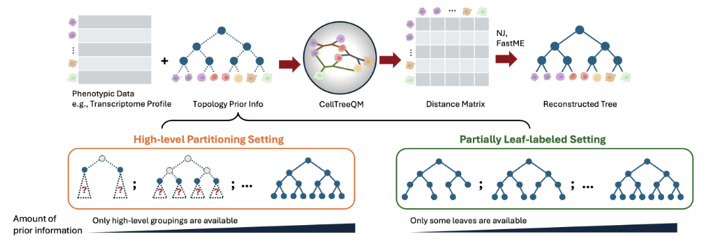

## CellTreeQM: Reconstructing Cell Lineage Trees from Phenotypic Features via Metric Learning

[](https://proceedings.mlr.press/v267)

This repository contains the official implementation of CellTreeQM, our ICML 2025 paper:

> **Reconstructing Cell Lineage Trees from Phenotypic Features with Metric Learning**  
> Da Kuang, Guanwen Qiu, Junhyong Kim  
> 📄 [Read the paper](https://arxiv.org/abs/2503.13925)
> 📖 [Project page](https://celltreeqm.github.io)

### Overview

CellTreeQM is a deep learning framework for reconstructing cell lineage trees directly from phenotypic features (e.g., transcriptomic data). By framing the problem as **metric learning**, CellTreeQM learns an embedding space optimized for tree-metric properties using **quartet-based losses**.



### Code Availability

The code will be released soon. Stay tuned for the full implementation including training scripts, loss functions, and benchmark evaluation.

Please star ⭐ this repo to get notified once the code is released!

### Citation

```bibtex
@article{kuang2025reconstructingcelllineagetrees,
      title={Reconstructing Cell Lineage Trees from Phenotypic Features with Metric Learning}, 
      author={Da Kuang and Guanwen Qiu and Junhyong Kim},
      year={2025},
      eprint={2503.13925},
      archivePrefix={arXiv},
      primaryClass={cs.LG},
      url={https://arxiv.org/abs/2503.13925}, 
}
```
